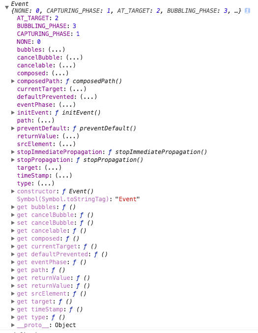

# 移动端
<strong>rem布局</strong>
```css
//css方式
html {
    font-size : 100px;
}
@media only screen and (min-width: 319px){
    html {
        font-size: 85px !important;
    }
}
@media only screen and (min-width: 349px){
    html {
        font-size: 90px !important;
    }
}
@media only screen and (min-width: 359px){
    html {
        font-size: 96px !important;
    }
}
@media only screen and (min-width: 374px){
    html {
        font-size: 100px !important;
    }
}
@media only screen and (min-width: 413px){
    html {
        font-size: 110px !important;
    }
}
@media only screen and (min-width: 479px){
    html {
        font-size: 125px !important; 
    }
}
```
```js
(function (doc, win) {
    var docEl = doc.documentElement,
        resizeEvt = 'orientationchange' in window ? 'orientationchange' : 'resize',
        recalc = function () {
            var clientWidth = docEl.clientWidth;
            if (!clientWidth) return;
            if(clientWidth>=640){
                docEl.style.fontSize = '100px';
            }else{
                docEl.style.fontSize = 100 * (clientWidth / 640) + 'px';
            }
        };

    if (!doc.addEventListener) return;
    win.addEventListener(resizeEvt, recalc, false);
    doc.addEventListener('DOMContentLoaded', recalc, false);
})(document, window);
```
1、这个大致意思就是当屏幕大于640px是font-size为100px，当小于640px的时候，就是按照100*（屏幕宽度／640）<br/>
2、为什么是640px？<br/>
因为640px是移动端屏幕的安全宽度，会保证在屏幕上不产生留白<br/>
3、为什么要设置html的font-size？<br/>
因为rem是根元素的尺寸大小，但凡涉及到尺寸的都可以使用rem，如果你把font-size设置成20px，那么rem就等于20px，但是换算比较麻烦

# 事件模型
## 1、event简介
在浏览器中控制台输入
```
console.log(Event.prototype)
```
可以看见如下的图：<br/>

## 2、事件的三种模型
1）原始事件模型<br/>
原始事件模型就是事件发生后没有传播概念，没有事件流书写代码的形式有一下两种<br/>
```
//在html标签中绑定
<input onclick="change()" type="button" />
//绑定在js代码中
document.getElementsByTag('input')[0].click = func1
```
优点：<br/>
所有浏览器都兼容<br/>
缺点：<br/>
逻辑和显示没有分离<br/>
事件会被后面绑定的覆盖掉<br/>
没有事件捕获，事件委托，事件冒泡等机制<br/>
2)IE事件模型<br/>
绑定事件attachEvent('eventType','handler')，解除事件deatchEvent('eventType','handler'),注意click事件前面需要加on<br/>
优点：<br/>
解决了原始事件模型的三个不行的地方<br/>
缺点：<br/>
只能在IE浏览器中使用<br/>
3)DOM2事件模型<br/>
事件分为三个阶段<br/>
事件捕获阶段：事件通过document向下传递到目标元素的时候，在这个过程中会检查事件是否注册监听，如果有则执行<br/>
事件处理阶段：事件到达目标元素，然后执行目标元素的处理函数<br/>
事件冒泡阶段：事件通过document向上传递到达目标元素的时候，在这个过程中会被检查事件是否注册监听，如果有则执行<br/>
所有事件都存在事件捕获，部分事件存在事件冒泡，如submit事件就不存在冒泡<br/>
代码实现：<br/>
```
var a = document.getElementById('button')
if(a.attachEvent){
    a.attachevent('onclick',func)
}else{
    a.addEventLister('click',func,false)
}
```
# 迭代器和生成器
## 什么是迭代器
迭代器是专门被设计用来迭代的对象，带有特定的接口。所有的迭代器对象都拥有next()方法，会返回一个结果对象。该结果对象有两个属性：对应下一个值的value，以及一个布尔类型done，其值为true时表示没有更多可以提供使用。迭代器持有一个指向集合位置的内部指针，每当调用了next()方法，迭代器就会返回一个值，若最后一个值返回后在调用next()。所返回的done就会是true。<br/>
接下来是ES5的迭代器代码简单实现：
```
function createIterator(items) {
    var i = 0;
    return {
        next: function() {
            var done = (i >=items.length);
            var value = !done ? items[i++]:undefined;
            return {
                done:done,
                value:value
            };
        }
    };
}
var iterator = createIterator([1, 2, 3]);
console.log(iterator.next()); // '{value: 1, done: false}';
console.log(iterator.next()); // '{value: 2, done: false}';
console.log(iterator.next()); // '{value: 3, done: false}';
console.log(iterator.next()); // '{value: undefine, done: true}';
//之后所有的调用value都会输出undefine，done都会输出true
```
## 什么是生成器
生成器是能返回一个迭代器的函数。生成器函数由放在function关键字之后的一个星号(*)来表示，并能使用新的yield关键字。将星号紧跟在function之后，或是中间留空号都没有问题。如以下这个例子：
```
function * createIterator() {
    yield 1;
    yield 2;
    yield 3;
}
//生成器能像正规函数一样被调用，但会返回一个迭代器
let iterator = createIterator();
console.log(iterator.next().value); //1
console.log(iterator.next().value); //2
console.log(iterator.next().value); //3
```
生成器最有意思的地方是他们都会在每个yield语句后停止执行，直到迭代器的next()方法被调用<br/>
yield只能在生成器函数内部使用，在其他地方使用会报错
## 生成器函数表达式
只要在function和()之间使用一个星号就行，如：
```
function * (){
    ...
}
```
不能将箭头函数创建为生成器<br/>
也可以使用ES6的速记法，在方法名之前加星号，如：
```
var o = {
    *createIterator(){
        ...
    }
}
```
## 迭代器的作用
迭代器解决了for循环追踪索引的问题
## 生成器的作用
它允许你通过写一个保存自己状态的简单函数来定义一个迭代算法

# 作用域链的作用
作用域链保证了执行环境能访问变量和函数是有序的，只能向上访问，最高级是window对象，向下访问是禁止的

# web储存
1、cookie<br/>
cookie可以保存客户端数据，减轻服务器压力，但是有很多局限性
1）局限性
```
数量限制
每个浏览器不同，有些没有如chorme和Safari，其他各有不同
大小限制
最大4k，超出会被截掉
```
2、sessionStorage
sessionStorage又称会话储存，在会话结束后会被清理掉
3、localStorage
localStorage是永久储存，是Html5中新引入的，除非手动删除

# 如何去做储存
1、cookie<br/>
开发者需要自己去封装setCookie和getCookie方法，但是cookie是不可或缺的：cookie的作用是与服务器进行交互，作为http规范的一部分而存在
2、webStorage
webStorage是本地存储，为本地的数据储存而生，sessionStorage和localStorage都拥有相同的操作方法，例如setItem、getItem和removeItem

# Promise
